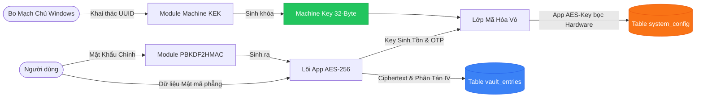
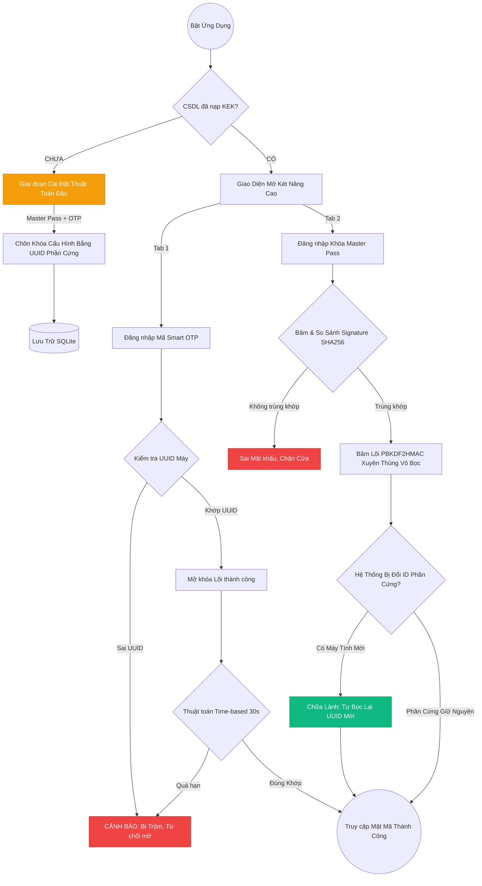

# TÀI LIỆU ĐẶC TẢ KỸ THUẬT: MANAGER PASSWORD
**Phiên bản hệ thống:** 3.0 (Bản sao lưu SQLite - Hardware Anti-Theft)
**Mô hình định danh:** Kép (Smart OTP & Master Password + Hardware Binding)

---

## I. TỔNG QUAN KIẾN TRÚC MỚI (SYSTEM OVERVIEW)
Ở phiên bản V3.0, **Manager Password** đã từ bỏ tệp lưu trữ rỗng JSON để chuyển sang một **Hệ Cơ Sở Dữ Liệu Quan Hệ (SQLite)**. Hệ thống đã tiến hóa thành một "Két sắt công nghệ lai" nơi trang bị cả hai cổng ủy quyền siêu việt là Cổng truy cập sinh trắc thời gian (OTP) cực nhanh và Cổng thoát hiểm thông tuệ (Master Pass). Đặc biệt, tính năng **Mã hóa Định danh Phần cứng (Hardware Anti-Theft)** biến hệ cơ sở dữ liệu khóa chặt vào chiếc bo mạch chủ Windows cụ thể của thiết bị.

---

## II. ĐẶC ĐIỂM KỸ THUẬT NỔI BẬT TRONG MÃ NGUỒN (CODE HIGHLIGHTS)

Hệ thống được thiết kế bằng các tiêu chuẩn mật mã học cao nhất, nổi bật ở các điểm mã lệnh như sau:

> [!CAUTION] 
> Tính Năng Chống Đánh Cắp Tập Tin Vật Lý (Anti-Theft) `get_machine_id`
Thay vì lưu chìa khóa Lõi trong CSDL, ứng dụng sử dụng lệnh `wmic csproduct get uuid` để lấy Mã Vân Tay Bo Mạch Windows. Từ mã này băm ra một chốt chặn Khóa Máy (Machine KEK). Bất kỳ ai ăn cắp được `vault.db` cũng không thể giải mã nội dung vì mã vi mạch máy tính của tên trộm và thiết bị gốc là khác nhau hoàn toàn.

> [!TIP]
> Thuật Toán Chữa Lành Tự Động (Auto-Healing Binding)
Khi đổi máy vi tính, cổng OTP bị từ chối khẩn cấp. Tuy nhiên, bằng cách gõ tay chính xác *Master Password* tại Tab số 2, lệnh sinh Khóa Lõi `PBKDF2HMAC` sẽ đánh thẳng vào não bộ thuật toán, tự động bắt một mã UUID Máy tính mới và Bọc Lại (Re-Binding) toàn bộ Cấu hình CSDL giúp hệ thống hồi sinh OTP một cách ma thuật.

> [!NOTE]
> Ổ Lưu Nhưng Không Nạp Cả Ổ (SQLite Optimized Vault)
Lõi `storage.py` định tuyến ghi đè lệnh `INSERT INTO` và `DELETE` lên SQL theo khóa ID của Mật khẩu. Hỗ trợ cho phép thêm triệu tài khoản mà vẫn mượt mà không bao giờ bị đứng máy như các bản phần mềm thao tác JSON dạng FLAT.

---

## III. SƠ ĐỒ LƯU CHUYỂN DỮ LIỆU (DATA FLOW DIAGRAM)

Biểu đồ này biểu diễn việc các giá trị Thô (Raw Input) đi qua các module Băm Toán Học (Hashing/PBKDF2) rồi được đóng rập định danh Phần Cứng như thế nào trước khi hạ thổ chôn xuống SQLite:

---

## IV. SƠ ĐỒ HOẠT ĐỘNG KIỂM DUYỆT (APP ACTIVITY DIAGRAM)

Dưới đây thuật toán luân chuyển trạng thái (State-Machine Diagram) để lý giải tại sao OTP chỉ mở trên máy nhà, nhưng Master Pass thì chấp luôn cả khi đổi máy vi tính:

---

## V. HƯỚNG DẪN VẬN HÀNH (OPERATIONAL MANUAL)

### Bước 1: Giai đoạn Khởi tạo Nền Tảng KEK (Setup)
- Tại lần bật đầu tiên, mọi định dạng Dữ liệu sẽ phải cung cấp để đóng Chữ ký Sinh Trắc Phần Cứng (Hardware UUID).
- Dữ liệu Google OTP sẽ được sinh ra và chôn thẳng vào DB dính liền bo mạch máy.

### Bước 2: Truy cập thường nhật (Tốc Độ Cao)
- Hãy sử dụng Cổng Số 1: **Mã Smart OTP**.
- Giao thức này sẽ tự đọc mã Lõi phần cứng, đối chiếu với số Google OTP 6 chữ số. Việc vào Két sắt chỉ mất 1 giây và gần như miễn nhiễm 100% rủi ro với tin tặc mạng.

### Bước 3: Di cư hoặc Đổi Thiết Bị (Mất Ổ Cứng/ Mất Máy Tính)
- Nếu Máy hỏng hoặc bạn Đổi máy tính (Nhưng vẫn giữ được file cấu hình cục bộ `vault.db`):
- Lúc này Cổng số 1 OTP bị đóng chặt hoàn toàn (Vì sai Máy Tính).
- Đừng hoảng sợ, chuyển sang Cổng Số 2: **Khóa Master Pass**.
- Hãy gõ trí lực của bạn vào đây. Nếu băm Chữ ký đúng, Lõi sẽ bốc cháy sinh ra và Tái Khởi Tạo (Healing) lại toàn bộ cái CSDL của bạn vào cái Mã Số Của Cỗ Máy Vi Tính Mới này. Ở lần sau, bạn sẽ lại dùng Cổng 1 mượt mà! 
- Đừng quên ấn **Đăng Xuất Phiên** dọn rác bộ nhớ (Memory Cleared) khi ngưng dùng ứng dụng.
